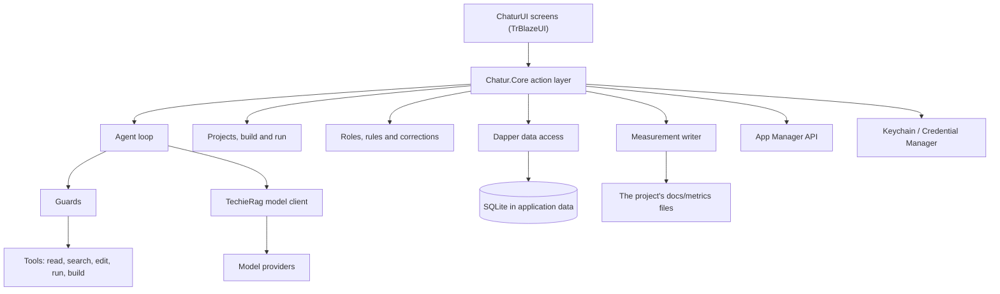
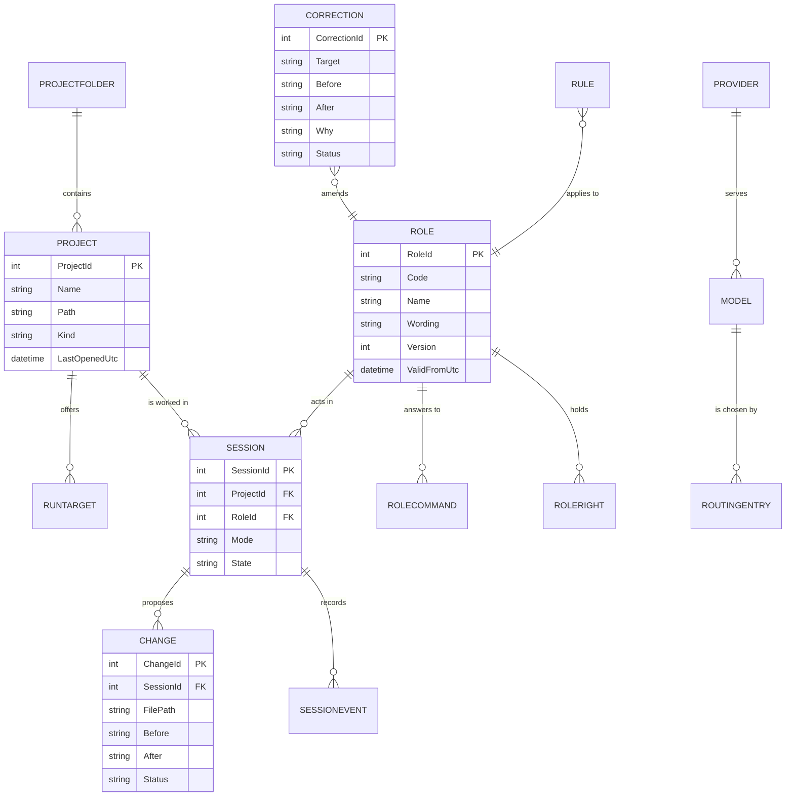

# Chatur — Architecture

| | |
|---|---|
| App | Chatur |
| Kind | app |
| Size | Large |
| Stack answer set | dotnet (`.tfcore/templates/stack-defaults/dotnet.md`) |
| Date | 2026-09-21 |

## 1. Stack decisions

One row per stack question. "Source" says where the answer came from: the answer set, the owner, or the existing code.

| Q | Topic | Decision | Source |
|---|---|---|---|
| Q1 | Configuration | Non-secret settings live in `appsettings.json`, layered by `appsettings.{Environment}.json`. No second settings mechanism is created. Per-machine choices the owner makes in the app (project folders, selected project, run target) are rows in the database, not settings files. | answer set: dotnet |
| Q2 | Secrets in development | Project user secrets (`dotnet user-secrets`) on the developer machine. `appsettings.Development.json` is committed and never holds a real secret. `secrets.example.json` lists every key the application reads. At run time on a real machine, model keys and sign-in tokens are in the operating system's store — see Q4 and §5. | answer set: dotnet |
| Q3 | Database | **Override of the answer set.** SQLite, one file in the user's application-data folder, never beside the program. Dapper for data access, DbUp for migrations, no EF Core. A migration that has shipped in a nightly build is never edited; a new one is added. | owner, day-1 (`docs/Chatur-Technical-Decisions.md`) |
| Q4 | Authentication | App Manager, as `docs/AppManager-api-usage-guide.md` describes: `POST /AuthSvc/device-register` and `POST /AuthSvc/device-login` with a `deviceId` generated once per installation and kept, passwords RSA-encrypted with the key from `GET /AuthSvc/public-key`. Tokens live in the Keychain on the Mac and Credential Manager on Windows. Feedback, issues, licences and feature control use App Manager in phase 4. | answer set: dotnet (Q4 asked) + owner, day-1 |
| Q5 | Logging | Serilog, wired at startup before anything else can fail. A log file under the application-data folder beside the database on a real machine, and under `bin/` in development. | answer set: dotnet (file path adjusted for a desktop app, owner day-1) |
| Q6 | Tests | xUnit, from day one, running on macOS and on Windows. Unit tests for `Chatur.Core` and every guard class; Playwright tests against `Chatur.WebHarness` for the screens; the Windows app window is driven by the Windows test bridge, the Mac app window by Appium once the Mac is registered in `core-config.yaml`. | answer set: dotnet + owner, day-1 |
| Q7 | Layout and naming | `src/` and `tests/` at the root. The primary head is named exactly `Chatur`. Secondary projects take a descriptive suffix. | answer set: dotnet |
| Q8 | User interface | TrBlazeUI 2.0.9 (`TrBlazeUI.Components`, `TrBlazeUI.Icons.Lucide`, GitHub Packages feed) for every view. Views live in `ChaturUI`, a Razor class library, and are rendered by a `BlazorWebView` in the MAUI host — interactive by nature, so no Blazor render mode is chosen. The same components render in `Chatur.WebHarness` for the browser checks. TrBlazeUI ships no named themes, only a stock grey set of OKLCH variables, so Chatur names its own: Amber by default, with Indigo, Teal and Slate, each a file of values in the same shape. | answer set: dotnet + owner, day-1 and 2026-09-22 |
| Q11 | Standing rules | The answer set's eleven rules, with two adjustments for a desktop app: log files go to the application-data folder on a real machine (rule 6 keeps `bin/` for development), and migrations live in `ChaturDb` (rule 5) rather than a folder of loose scripts. Added for this product: a model never runs a source-control command by its own choice, and anything TechieRag lacks is added in the TechieRag repository, never worked around in Chatur. | answer set: dotnet + owner, day-1 |

Q9 (hosting) and Q10 (production secrets) are not yet asked; they are answered after user acceptance testing. Chatur ships as a download, so Q9 is about the release pipeline — see §6.

## 2. Solution structure

| Project | Kind | Purpose |
|---|---|---|
| `Chatur` | MAUI Blazor Hybrid app (Mac Catalyst, Windows) | The primary head. Hosts the `BlazorWebView`, owns platform services: the secret store, the file dialogs, launching processes, opening a file in another program. |
| `ChaturUI` | Razor class library | Every view and component, built with TrBlazeUI. No behaviour beyond presentation. One folder per view: the window shell (menu bar, toolbar, files panel, tab host, conversation panel, output strip), then one component per view that opens as a tab, and one per Settings tab. Every component is a `.razor` file with its own `.razor.cs` code-behind — never markup and logic in one file, and never one page holding several tabs. The themes live here too, as one file of OKLCH values per theme. |
| `Chatur.Core` | class library | Every behaviour behind one action layer: projects, build and run, models and routing, the agent loop, guards, roles and rules, corrections, measurements, source control, App Manager. No screens. |
| `ChaturDb` | migrations project (console) | DbUp migrations and the seed data for roles, rules and process wording. Run by the app at startup. |
| `Chatur.WebHarness` | Blazor web app | Test only. Shows `ChaturUI`'s screens in a browser so the headless browser checks can run on every build. Never shipped to the owner. |
| `Chatur.Tests` | xUnit test project | Unit tests for `Chatur.Core` and every guard class; runs on macOS and on Windows. |

## 3. Component map

**How a request travels** (one typical request, in words; per-screen detail is in the DevGuide):

1. The owner types a message on the Chat screen and presses send. The screen calls one method on the action layer, passing the selected project, the chosen role and the text.
2. The action layer reads the role, its rights and its model tier from the database, then asks the routing component which model to use and hands the conversation to TechieRag.
3. The model answers with a tool request. Every request goes through the guards first: the role's rights, the "ask me first" setting, and the standing refusal of source-control commands. A refused request never reaches a tool.
4. An allowed tool runs — reading a file, editing one, running a build. An edit is held as a proposed change until the owner approves it on the Changes screen, unless the session is in "go ahead".
5. The loop records the step, the tokens and the model in the session, and the measurement writer appends a record to the project's `docs/metrics` files.
6. The screen shows the reply, the model that answered and the running token count, and the activity panel adds the step.

## 4. Data model

| Entity | Key fields | Notes |
|---|---|---|
| ProjectFolder | `FolderId`, `Path` | A folder the owner named for Chatur to search. |
| Project | `ProjectId`, `Path`, `Name`, `Kind` | Found by searching the folders. One is the selected project. |
| RunTarget | `RunTargetId`, `ProjectId`, `Name`, `Command`, `Platform` | The targets that fit this machine; the one last used is offered first. |
| Provider | `ProviderId`, `Name`, `Connector`, `SignInMethod`, `BaseUrl` | One connector, one sign-in method, one web address, so a new vendor is a new row. The secret itself is in the operating system's store; the row keeps only the name it is stored under. |
| Model | `ModelId`, `ProviderId`, `Tier`, `Identifier` | A model a provider serves, in a tier. |
| RoutingEntry | `RoutingEntryId`, `RoleId`, `WorkKind`, `Tier`, `Order` | The tier for a role and a kind of work, and the order of the fallback chain. |
| Role | `RoleId`, `Code`, `Wording`, `Version`, `ValidFromUtc` | Versioned. An edit writes a new version; the old one stays for the history. |
| RoleRight | `RoleRightId`, `RoleId`, `Action`, `Allowed` | What the role may do. The guards read this and nothing else. |
| RoleCommand | `RoleCommandId`, `RoleId`, `Command`, `Description` | The commands the role answers to. |
| Rule | `RuleId`, `Scope`, `Text`, `Version` | Versioned the same way as Role. |
| ProcessStepText | `StepTextId`, `ProcessCode`, `StepCode`, `Text`, `Version` | The wording of a step. The steps and checks themselves are code. |
| Session | `SessionId`, `ProjectId`, `RoleId`, `Mode`, `State` | `Mode` is "ask me first" or "go ahead". A session can be continued later. |
| SessionEvent | `EventId`, `SessionId`, `Seq`, `Kind`, `Payload`, `Model`, `Tokens` | One row per step: message, tool request, refusal, result. |
| Change | `ChangeId`, `SessionId`, `FilePath`, `Before`, `After`, `Status` | A proposed edit, waiting for approve or reject. |
| Correction | `CorrectionId`, `Target`, `Before`, `After`, `Why`, `Status` | A change Chatur made to a role, rule or step wording, in the same shape as a miss, kept or undone. |
| Setting | `Key`, `Value` | Per-machine choices made in the app, including the chosen theme and whether it follows light, dark or the machine. |
| Theme | `ThemeId`, `Name`, `Values`, `Source` | A named set of colour values in the shape TrBlazeUI takes. Four ship with the build; `Source` says whether a theme came with the build or was added from a file. |
| Installation | `DeviceId`, `CreatedUtc` | The identifier sent to App Manager at sign-in, generated once and kept. |

## 5. Cross-cutting

- **Identity:** App Manager. The installation generates a `deviceId` once and keeps it; sign-in and registration send it, and the answer carries the device and any licence cap. The access and refresh tokens are written to the Keychain on the Mac and Credential Manager on Windows, never to the database. Sign-out sends the refresh token so only this device is signed out.
- **Secrets:** every model key, subscription token and App Manager token is in the operating system's store. The database keeps the name a secret is stored under, never the secret.
- **Configuration:** `appsettings.json` plus the environment layer for non-secret settings; the database for what the owner chooses in the app.
- **Logging:** Serilog, wired first at startup, writing a file beside the database on a real machine and under `bin/` in development.
- **Errors:** a failure the owner caused is shown on the screen in the server's or the tool's own words. A failure inside Chatur is logged with its detail and shown as one plain sentence with a way to send it as feedback. A failed measurement write is logged and never stops the work.
- **Guards:** every tool request passes guard classes that have unit tests. They read the role's rights, the session's mode and the standing refusals. A source-control command asked for by a model is always refused.
- **Measurements:** `runs.jsonl`, `gates.jsonl`, `misses.jsonl`, `sessions.jsonl` and `commits.jsonl` in each project's `docs/metrics` folder, appended and never edited, with `chatur` as the name of the tool. Chatur's own schema lives in this repository and starts as a copy of TechieFlow's; it must keep matching in every field TfLens reads.

## 6. Decisions log

One row per decision. Every package added to the project has a row saying why.

| Date | Decision | Why | Status |
|---|---|---|---|
| 2026-09-21 | .NET 10, MAUI Blazor Hybrid for Mac Catalyst and Windows, equal from the first release | The owner works on both machines and needs the same tool on each | decided |
| 2026-09-21 | Screens in `ChaturUI` with TrBlazeUI; behaviour in `Chatur.Core` behind one action layer | Keeps the screens testable in a browser and the behaviour testable without a window | decided |
| 2026-09-22 | Package `TrBlazeUI.Components` 2.0.9 and `TrBlazeUI.Icons.Lucide` 2.0.9, from the owner's GitHub Packages feed | The owner's component library; every view is built from it. 2.0.9 answers all ten gaps Chatur filed, so `TreeView`, `DiffView`, `CodeEditor`, `EditorTabs`, `LogView`, `Typing`, `NavList`, `SortableList`, `DataTable` row selection and the small `Switch` replace ten controls that would otherwise have been hand-built | decided |
| 2026-09-22 | Three windows, not one: a start window (recent projects, open, clone, new), the main window (menu bar, files, tabs, conversation, output), and one secondary window carrying everything that is not the work — Prerequisites, Repository, Settings, Licence, Feedback, Integrations, All projects, Working copies | A settings page has no business carrying a file tree and a conversation, and git operations are not a tab in the editor (owner review, 2026-09-22) | decided |
| 2026-09-22 | Every menu and every picker in the product opens a real list; nothing that looks like a drop-down may be a label | Said plainly at the review: a control that looks like it opens and does not is worse than no control | decided |
| 2026-09-21 | Package `TechieRag` 1.0.7 | Every model call goes through it; Chatur never starts another company's coding tool | planned |
| 2026-09-21 | `nuget.config` naming the owner's private GitHub Packages feed beside nuget.org, with no credentials in the file | TrBlazeUI and TechieRag come from that feed; the token stays in the machine's own NuGet settings, outside the repository | planned |
| 2026-09-21 | Packages `Dapper`, `DbUp` and `Microsoft.Data.Sqlite` | Data access and migrations, as the technical decisions require; no EF Core | planned |
| 2026-09-21 | Package `Serilog` with the file sink | Stack answer set Q5 | planned |
| 2026-09-21 | SQLite in the user's application-data folder | The owner's data must survive every update, which a file beside the program does not | decided |
| 2026-09-21 | A shipped migration is never edited; a new one is added | A nightly build the owner already runs has that migration applied | decided |
| 2026-09-21 | Roles, rights, commands, rules and step wording are versioned database rows, seeded from data that ships with each build | Prose files failed; Chatur must be able to correct them itself and show the history | decided |
| 2026-09-21 | What TechieRag lacks is added in the TechieRag repository | Standing rule 3 of the answer set; a workaround here would hide the gap | decided |
| 2026-09-21 | `Chatur.WebHarness`, a test-only web head | The browser checks cannot look inside a Mac or Windows app window, and the screens are the same components | decided |
| 2026-09-22 | Chatur is one desktop window with a menu bar (File, Edit, View, Project, Tools, Help), a toolbar, the project's files down the left with the branch beneath them, one content area of tabs, and the conversation pinned to the right at half the width | Two earlier designs were refused for being a web application wearing a desktop name: a sidebar of pages, then a rail of roles. A view is a tab, not a route (owner review, 2026-09-22) | decided |
| 2026-09-22 | The conversation is never more than half the window and never goes away, except when the owner closes the file view, when it takes the whole window; a folder with no project in it starts that way | The product is the conversation. Files are what it is talking about (owner, 2026-09-22) | decided |
| 2026-09-22 | The agent is chosen beside the Send button, the model itself is the default, and Chatur pre-selects the agent that suits the project's state and says why | Picking a role before knowing what you want is friction; the state of the project already says who should work (owner, 2026-09-22) | decided |
| 2026-09-22 | Agents differ by what they may do, never by colour. Chatur seeds the Analyst, the Architect, the Flow master and the Verifier; a library specialist such as a TrBlazeUI or TechieRag agent is added by the owner, not built in | Colour-coding roles made six themes out of one product; and a library agent belongs to the library, not to Chatur (owner, 2026-09-22) | decided |
| 2026-09-22 | Theming is a system, not two palettes: a theme is a named set of OKLCH values in the shape TrBlazeUI takes, held as data, chosen on Settings ▸ Appearance, and one can be added from a file without a new build. Amber ships as the default, with Indigo, Teal and Slate | TrBlazeUI itself has no named themes — it takes a shadcn theme block — so Chatur has to own the naming, and the owner wants to add more later (owner, 2026-09-22) | decided |
| 2026-09-22 | Each Settings tab is its own routed component with its own code-behind; the tab strip is navigation, not a control | So a tab can be read, tested and changed on its own, instead of one page and one class holding all seven (owner, 2026-09-21) | decided |
| 2026-09-22 | A file with a change waiting on it is read-only in the editor until the change is approved or rejected | Otherwise the owner is typing into a file that has two versions of itself on screen (owner, 2026-09-22) | decided |
| 2026-09-22 | The screen that lists the tools a project needs is called Prerequisites, under the Project menu | "Doctor" says nothing about what it is for, and "Requirements" collides with the requirements of the product itself (owner, 2026-09-22) | decided |
| 2026-09-21 | Automatic check-ins go to the run's own branch, with the requirement ids in the message; pushing and merging stay with the owner | A model that can commit, reset or push freely can lose work | decided |
| 2026-09-21 | Release by GitHub Actions: a Mac job (Mac Catalyst `.app`, zipped) and a Windows job (unpackaged, self-contained, `WindowsPackageType` None, zipped). Every push to main publishes a nightly pre-release; a version tag publishes a named release. Version and commit are stamped into the build. No code signing before phase 4 | The owner installs from the download on both real machines from step 1 | decided |

## 7. Module responsibilities

| Module | Responsibility | Depends on |
|---|---|---|
| Projects | Search the named folders, hold the selected project, read its stack | Data access |
| Build and run | Offer the targets that fit the machine, build, run, stream output, stop the whole process tree | Projects |
| Doctor | Probe each tool a project needs, report version or fix, report Chatur's own version and commit | Projects |
| Models | Providers, their secrets, their models, and the routing that picks one | Secret store, TechieRag |
| Agent loop | Run a session: messages, tool requests, results, tokens, stop | Models, Guards, Tools |
| Guards | Decide whether a tool request may run | Roles |
| Roles and rules | Read, edit and version roles, rights, commands, rules and step wording; correct them and log the correction | Data access |
| Changes | Hold proposed edits, apply or discard them | Agent loop |
| Measurements | Append the five streams to the project's `docs/metrics` folder | Projects |
| Accounts | Sign in, register, sign out, tokens, devices, licence | App Manager, Secret store |
| Source control | Show changes, check in, push, pull, switch branches, and the run's own branch | Projects |

## 8. Open questions

- Can Chatur be used with no internet, given that sign-in goes through App Manager? A stored token that is still valid would allow it; the answer decides whether a "work offline" state is needed.
- Which App Manager server address and application identity does Chatur use, and where do its API key and secret live on a real machine?
- Which run targets belong in step 1 beyond web, Mac and Windows: an Android emulator, an iOS simulator, plain .NET and Node programs?
