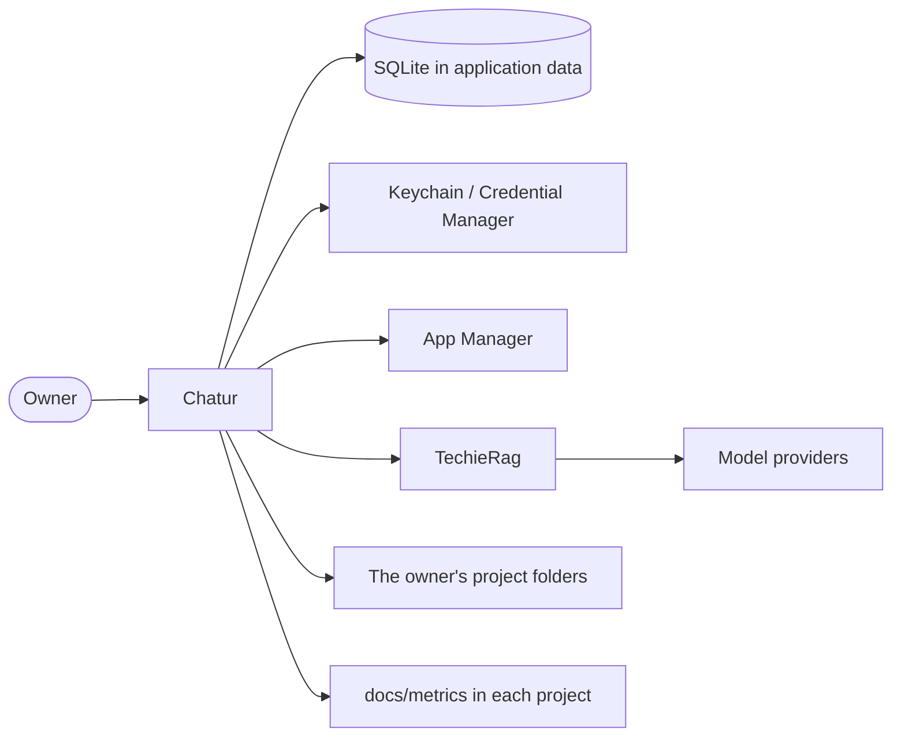

# Chatur — Business Requirements

| | |
|---|---|
| App | Chatur |
| Kind | app |
| Size | Large |
| Phase | 1 of 4 |
| Stack answer set | dotnet (`.tfcore/templates/stack-defaults/dotnet.md`) |
| Status | Draft |
| Date | 2026-09-21 |

## 1. Summary

Chatur is a development environment for Mac and Windows where one person builds software by directing AI agents. The owner picks a project, chats with a role — analyst, architect, flow master, verifier or a library specialist — and that role reads, searches, edits and creates files, runs commands, and builds and runs the project, while the owner watches, approves each change and stops the work whenever he wants. It replaces the owner's TechieFlow framework and the coding tools it sits on, and talks to the AI models directly through TechieRag. The roles, their rights, their commands, the rules and the steps of a process are rows in Chatur's own database, so when one of them proves wrong during work Chatur corrects it on the spot and logs the correction for the owner to keep or undo. Nothing is carried by hand to a second repository. This phase, the Workbench, is the whole product at its smallest: sign in, find and run a project, connect models, chat with a role, watch and approve what the agent does, and edit and check in the result.

## 2. Scope

**In:**

- Installing on a real Mac and a real Windows machine from a download that every change to the main branch produces, with the owner's data surviving each update.
- Signing in, registering and signing out through App Manager.
- Finding projects in the folders the owner names, and choosing one to work on.
- Building, running and stopping a project with a target that fits the machine, watching the output live.
- A Prerequisites view: each tool a project needs before it will build, the version found, the fix when missing, and Chatur's own version and commit.
- Model sources — a pasted key, a local model, a ChatGPT subscription sign-in — with secrets in the operating system's store.
- Model routing: a tier per role and per kind of work, fallback chains, and a stronger model after repeated failed fixes.
- Chatting with a chosen role about the selected project, seeing which model answered and the tokens used.
- Roles, rights, commands, rules and process steps as versioned rows in Chatur's database, exported and imported between machines.
- An agent that reads, searches, edits and creates files, runs commands and builds the project, with every request passing guards first.
- Watching the agent live, stopping it, and choosing "ask me first" or "go ahead" for a session that can be continued later.
- Reviewing each change as before and after, and approving or rejecting it.
- Corrections Chatur makes to its own roles and rules, logged and reviewable.
- The five measurement files written into each project's `docs/metrics` folder, with `chatur` as the name of the tool.
- A built-in editor for quick edits, and a Repository view for changes, check-in, push, pull, branches and history.
- Later phases: the project workflow as Chatur processes, the end-to-end unattended run, and the move to more users. See `docs/Chatur-Phases.md`.

**Out:**

- Starting, wrapping or depending on Claude Code, OpenCode, Codex or TechieFlow's scripts, and putting anything into a project's folder.
- A Claude subscription sign-in, which Anthropic does not allow. Claude is used with a key.
- A debugger, a property grid and package-manager screens. The editor is for quick edits.
- Chatur correcting a bug in its own program. That follows the feedback process and arrives as the next build.
- Payments, a phone version and a web version of Chatur.
- Signed installers before phase 4.

## 3. Users and roles

| Role | Who they are | What they need |
|---|---|---|
| Visitor | Someone who has opened Chatur and is not signed in | To sign in, or to register an account |
| Owner | The developer who owns the projects, working on a Mac and a Windows machine | Everything: projects, models, chat, the agent, changes, the editor and source control |
| Licensed developer | Another developer, signed in and licensed through App Manager (phase 4) | The same as the owner, on his own projects, within his licence |

Inside Chatur the AI plays its own agents — the Analyst, the Architect, the Flow master and the Verifier. They are rows in Chatur's database with their own rights, commands and rules, not people who sign in. The agents page in Settings is where the owner reads and changes them, and where a library specialist such as a TrBlazeUI or TechieRag agent is added.

## 4. Screens and flow

Chatur is a desktop application with three windows. The **start window** opens first and holds nothing but the projects worked in and the ways into one. The **main window** is where work happens: a menu bar, a toolbar, the project's files down the left with the branch beneath them, one content area of tabs, and the conversation pinned to its right. The **secondary window** holds everything that is not the work — prerequisites, the repository, every setting — as a title bar, a list down its left, and one page; it carries no file tree and no conversation, because there is nothing to say to an agent while changing a setting. Sign in and Register come before any window is usable.

| Screen | Route | Role | Mockup | Fields |
|---|---|---|---|---|
| Sign in | `/sign-in` | Visitor | [mockup](mockups/sign-in.html) | email, password, remember this device |
| Register | `/register` | Visitor | [mockup](mockups/register.html) | first name, last name, email, password, confirm password |
| Start | `/start` | Owner | [mockup](mockups/start.html) | recent projects, search, clone, open a solution, open a folder, new project, new empty folder |
| Workbench | `/` | Owner | [mockup](mockups/main.html) | files, tabs, file text, conversation, message, model, agent, mode, run target, output |
| Prerequisites | `/prerequisites` | Owner | [mockup](mockups/prerequisites.html) | tool, needed, found, fix, Chatur version, commit |
| Settings | `/settings/{page}` | Owner | [mockup](mockups/settings-providers.html) | the page chosen in the list, and its own fields |
| Add a provider (dialog) | on `/settings/providers` | Owner | [mockup](mockups/settings-providers.html) | name, connector, sign-in method, web address, key |
| Export and import (dialog) | on `/settings/agents` | Owner | [mockup](mockups/settings-agents.html) | file, what to include |
| Repository | `/repository` | Owner | [mockup](mockups/repository.html) | branch, changed files, message, check in, push, pull, history |

Settings is seven pages, each its own component with its own code behind it: [providers](mockups/settings-providers.html), [routing](mockups/settings-routing.html), [agents](mockups/settings-agents.html), [corrections](mockups/settings-corrections.html), [measurements](mockups/settings-measurements.html), [appearance](mockups/settings-appearance.html), [account](mockups/settings-account.html). An empty folder opened from the start window is a state of the Workbench, not a screen of its own: there is nothing to build, so the conversation takes the whole window and an agent helps think the thing through before any code exists — [drawn here](mockups/folder-only.html).

**Primary journey:**

1. The owner opens Chatur and signs in with his App Manager account.
2. The Start view lists where he was and the projects found in the folders he named.
3. He opens one. The files appear down the left and the conversation is already there on the right.
4. He asks for a change. Chatur has already chosen the agent that suits the project's state, and he can change it beside the Send button.
5. He watches it read, search and propose, and approves or rejects each change before it reaches a file.
6. He builds and runs from the toolbar, and the output fills the strip along the bottom.
7. He opens a file when he wants one; the conversation keeps its half, or he closes the file view and gives it the window.
8. He checks the work in himself from the Repository view, which no model may do.

## 5. Requirements

### Sign in

The way into Chatur for a returning owner, using his App Manager account.

- **BRD-1** — Sign in with an account. *Screen:* Sign in · *Mockup:* [mockup](mockups/sign-in.html)
  - *Acceptance:* When the owner enters a known email and password on Sign in, then Chatur opens the Projects screen signed in.
- **BRD-2** — The password never leaves the machine as text. *Screen:* Sign in · *Mockup:* [mockup](mockups/sign-in.html)
  - *Acceptance:* When Chatur sends a sign-in, then the password field carries the encrypted value and the plain password appears nowhere in the request.
- **BRD-3** — A refused sign-in says why. *Screen:* Sign in · *Mockup:* [mockup](mockups/sign-in.html)
  - *Acceptance:* When the password is wrong on Sign in, then Sign in shows the server's own message and the owner stays on the screen.
- **BRD-4** — The installation names its device. *Screen:* Sign in · *Mockup:* [mockup](mockups/sign-in.html)
  - *Acceptance:* When Chatur signs in, then it sends the device identifier it generated on first run, and sends the same one every time after.
- **BRD-5** — Staying signed in. *Screen:* Sign in · *Mockup:* [mockup](mockups/sign-in.html)
  - *Acceptance:* When the owner closes Chatur while signed in and opens it again, then it opens on Projects without asking for the password.

### Register

Where a new account is made, for the owner's second machine or for another developer later.

- **BRD-6** — Register an account. *Screen:* Register · *Mockup:* [mockup](mockups/register.html)
  - *Acceptance:* When the owner fills in name, email and a password that meets the rule, then the account is created and Chatur opens Projects.
- **BRD-7** — The password rule is visible while typing. *Screen:* Register · *Mockup:* [mockup](mockups/register.html)
  - *Acceptance:* When the owner types a password on Register, then the screen shows which parts of the rule are met and which are not.
- **BRD-8** — A weak password is caught before it is sent. *Screen:* Register · *Mockup:* [mockup](mockups/register.html)
  - *Acceptance:* When the password breaks the rule on Register, then Register refuses to send and marks the field.
- **BRD-9** — An email already in use is reported. *Screen:* Register · *Mockup:* [mockup](mockups/register.html)
  - *Acceptance:* When the email already has an account on Register, then Register shows the server's message and keeps what was typed.

### Start

What the window holds before a project is open: where the owner was, what Chatur found, and the folders it searches.

- **BRD-10** — Name the folders Chatur searches. *Screen:* Start · *Mockup:* [mockup](mockups/start.html)
  - *Acceptance:* When the owner adds a folder in the Project folders dialog, then it appears in the folder list on Projects.
- **BRD-11** — Chatur lists what it found. *Screen:* Start · *Mockup:* [mockup](mockups/start.html)
  - *Acceptance:* When a named folder holds projects on Start, then Projects lists each one with its name, path and when it was last opened.
- **BRD-12** — Choose the project to work on. *Screen:* Start · *Mockup:* [mockup](mockups/start.html)
  - *Acceptance:* When the owner opens a project from the list, then the Workbench opens on it and it becomes the selected project.
- **BRD-13** — The choice survives a restart. *Screen:* Start · *Mockup:* [mockup](mockups/start.html)
  - *Acceptance:* When Chatur is closed and opened again on Start, then the same project is still selected.
- **BRD-14** — Nothing named yet says what to do. *Screen:* Start · *Mockup:* [mockup](mockups/start.html)
  - *Acceptance:* When no folder has been named on Start, then Projects shows an empty state with a button that opens the Project folders dialog.
- **BRD-15** — Remove a folder. *Screen:* Start · *Mockup:* [mockup](mockups/start.html)
  - *Acceptance:* When the owner removes a folder in the dialog, then its projects leave the list and the folder is gone after a restart.

### Workbench — the project you are in

The top bar of the one working screen: which project, which branch, and the way out.

- **BRD-16** — What the selected project is. *Screen:* Workbench · *Mockup:* [mockup](mockups/main.html)
  - *Acceptance:* When a project is selected on Workbench, then the toolbar names it and its branch, and its files are listed down the left.
- **BRD-17** — Straight into the work. *Screen:* Workbench · *Mockup:* [mockup](mockups/main.html)
  - *Acceptance:* When a project opens, then the conversation with a role is already there, with no further step to reach it.
- **BRD-18** — Change project without going back. *Screen:* Workbench · *Mockup:* [mockup](mockups/main.html)
  - *Acceptance:* When the owner picks another project in the top bar, then the Workbench and every other screen show the new project.
- **BRD-19** — Sign out. *Screen:* Workbench · *Mockup:* [mockup](mockups/main.html)
  - *Acceptance:* When the owner signs out on Workbench, then Chatur returns to Sign in and the stored token no longer opens the app.

### Workbench — build and run

The Run control in the top bar and the output strip along the bottom. Only a role whose rights allow it may run anything.

- **BRD-20** — Only targets that fit the machine. *Screen:* Workbench · *Mockup:* [mockup](mockups/main.html)
  - *Acceptance:* When Run opens, then only a target this machine can build can be chosen, and one needing another machine is shown as unavailable.
- **BRD-21** — Build the project. *Screen:* Workbench · *Mockup:* [mockup](mockups/main.html)
  - *Acceptance:* When the owner builds on Workbench, then Run shows the result as succeeded or failed with the time it took.
- **BRD-22** — Run the project. *Screen:* Workbench · *Mockup:* [mockup](mockups/main.html)
  - *Acceptance:* When the owner runs the chosen target on Workbench, then the program starts and Run shows it as running.
- **BRD-23** — Watch the output live. *Screen:* Workbench · *Mockup:* [mockup](mockups/main.html)
  - *Acceptance:* When the program writes a line on Workbench, then it appears in the output panel while the program is still running.
- **BRD-24** — Stop everything the run started. *Screen:* Workbench · *Mockup:* [mockup](mockups/main.html)
  - *Acceptance:* When the owner stops the run on Workbench, then every program it started ends and Run shows it as stopped.
- **BRD-25** — A failed build shows the errors. *Screen:* Workbench · *Mockup:* [mockup](mockups/main.html)
  - *Acceptance:* When a build fails on Workbench, then the output strip lists each error with its file and line, and opening one opens that file.
- **BRD-26** — The last target is offered first. *Screen:* Workbench · *Mockup:* [mockup](mockups/main.html)
  - *Acceptance:* When the owner returns to Run for a project on Workbench, then the target he used last time is already chosen.

### Prerequisites

What the project needs before it will build, what is installed, and what Chatur itself is. Not to be confused with the requirements of the product itself, which live in this document.

- **BRD-27** — Every tool, with the version found. *Screen:* Prerequisites · *Mockup:* [mockup](mockups/prerequisites.html)
  - *Acceptance:* When Doctor opens for a project, then each tool it needs is listed with the version found or "not found".
- **BRD-28** — A missing tool says how to fix it. *Screen:* Prerequisites · *Mockup:* [mockup](mockups/prerequisites.html)
  - *Acceptance:* When a tool is missing from the machine, then its row on Prerequisites shows the command that installs it, ready to copy.
- **BRD-29** — Which Chatur this is. *Screen:* Prerequisites · *Mockup:* [mockup](mockups/prerequisites.html)
  - *Acceptance:* When Doctor opens, then it shows Chatur's own version and the commit the build came from.
- **BRD-30** — Homebrew tools are found on a Mac. *Screen:* Prerequisites · *Mockup:* [mockup](mockups/prerequisites.html)
  - *Acceptance:* When Chatur is started from Finder on a Mac, then Doctor still finds tools installed with Homebrew.
- **BRD-31** — A newer build is offered. *Screen:* Prerequisites · *Mockup:* [mockup](mockups/prerequisites.html)
  - *Acceptance:* When a newer nightly build exists on Prerequisites, then Doctor says so and links to the download for this machine.

### Settings — providers

The first tab: where the model sources are connected, and where their secrets are kept.

- **BRD-32** — Connect a source with a pasted key. *Screen:* Settings · *Mockup:* [mockup](mockups/settings-providers.html)
  - *Acceptance:* When the owner adds a provider and pastes a key on Settings, then it is listed as connected and its models can be chosen in routing.
- **BRD-33** — Connect a local model. *Screen:* Settings · *Mockup:* [mockup](mockups/settings-providers.html)
  - *Acceptance:* When the owner adds a local model with its web address on Settings, then it is listed as connected with no key.
- **BRD-34** — Sign in to a ChatGPT subscription. *Screen:* Settings · *Mockup:* [mockup](mockups/settings-providers.html)
  - *Acceptance:* When the owner chooses subscription sign-in, then the browser opens, and after he signs in the provider is listed as connected.
- **BRD-35** — Secrets go to the machine's own store. *Screen:* Settings · *Mockup:* [mockup](mockups/settings-providers.html)
  - *Acceptance:* When a key or token is saved on Settings, then it is in the operating system's store and Chatur's database holds only the name it is stored under.
- **BRD-36** — Check that a source answers. *Screen:* Settings · *Mockup:* [mockup](mockups/settings-providers.html)
  - *Acceptance:* When the owner tests a provider on Settings, then its row shows whether it answered, and the message when it did not.
- **BRD-37** — Remove a source. *Screen:* Settings · *Mockup:* [mockup](mockups/settings-providers.html)
  - *Acceptance:* When the owner removes a provider on Settings, then it leaves the list and its secret is deleted from the store.

### Settings — routing

The routing tab: which model does which work, and what happens when one is not available.

- **BRD-38** — A tier for each role. *Screen:* Settings · *Mockup:* [mockup](mockups/settings-routing.html)
  - *Acceptance:* When the owner sets a role's tier on Settings, then work started by that role uses a model from that tier.
- **BRD-39** — A tier for each kind of work. *Screen:* Settings · *Mockup:* [mockup](mockups/settings-routing.html)
  - *Acceptance:* When the owner sets a kind of work to a tier on Settings, then that setting wins over the role's tier for that work.
- **BRD-40** — Order the fallback chain. *Screen:* Settings · *Mockup:* [mockup](mockups/settings-routing.html)
  - *Acceptance:* When the owner reorders the models in a tier, then the new order is the order Chatur tries them in.
- **BRD-41** — A limited model steps aside. *Screen:* Settings · *Mockup:* [mockup](mockups/settings-routing.html)
  - *Acceptance:* When the chosen model is limited or unavailable on Settings, then Chatur uses the next in the chain and says which model answered.
- **BRD-42** — Repeated failed fixes climb a tier. *Screen:* Settings · *Mockup:* [mockup](mockups/settings-routing.html)
  - *Acceptance:* When the same fix has failed the set number of times on Settings, then Chatur moves that work to a stronger tier and records the move.
- **BRD-43** — Routing is remembered. *Screen:* Settings · *Mockup:* [mockup](mockups/settings-routing.html)
  - *Acceptance:* When Chatur is closed and opened again on Settings, then every tier, chain and role setting is as it was left.

### Workbench — the conversation

The panel pinned to the right of the window, where the work starts. By default the owner is talking to the model itself; an agent is chosen beside the Send button.

- **BRD-44** — Choose who to talk to. *Screen:* Workbench · *Mockup:* [mockup](mockups/main.html)
  - *Acceptance:* When a project opens, then Chatur has already chosen the agent that suits its state, and says beside the box why.
- **BRD-45** — Ask and be answered. *Screen:* Workbench · *Mockup:* [mockup](mockups/main.html)
  - *Acceptance:* When the owner sends a message about the selected project on Workbench, then a reply from the chosen role appears in the conversation.
- **BRD-46** — Which model answered. *Screen:* Workbench · *Mockup:* [mockup](mockups/main.html)
  - *Acceptance:* When a reply arrives on Workbench, then it names the model that produced it.
- **BRD-47** — The reply arrives as it is written. *Screen:* Workbench · *Mockup:* [mockup](mockups/main.html)
  - *Acceptance:* When a reply is being produced on Workbench, then its text grows in the conversation before the reply is finished.
- **BRD-48** — What it cost. *Screen:* Workbench · *Mockup:* [mockup](mockups/main.html)
  - *Acceptance:* When a reply is finished on Workbench, then the Workbench shows the tokens it used and the running total for the session.
- **BRD-49** — Watch what the agent is doing. *Screen:* Workbench · *Mockup:* [mockup](mockups/main.html)
  - *Acceptance:* When the agent reads a file, edits one or runs a command on Workbench, then that step appears in the activity panel as it happens.
- **BRD-50** — Stop the work. *Screen:* Workbench · *Mockup:* [mockup](mockups/main.html)
  - *Acceptance:* When the owner presses stop on Workbench, then the agent stops, the activity panel says so, and no further step is taken.
- **BRD-51** — Ask me first, or go ahead. *Screen:* Workbench · *Mockup:* [mockup](mockups/main.html)
  - *Acceptance:* When the owner sets the session's mode on Workbench, then the mode is kept with the session and shown while it runs.

### Settings — agents

The agents tab: the list of agents Chatur plays, read from its own database. Chatur ships the Analyst, the Architect, the Flow master and the Verifier; a library specialist is added here, not built in.

- **BRD-52** — Roles come from the database. *Screen:* Settings · *Mockup:* [mockup](mockups/settings-agents.html)
  - *Acceptance:* When a role's wording is changed in the database, then the roles tab shows the new wording without any file being edited.
- **BRD-53** — Rights at a glance. *Screen:* Settings · *Mockup:* [mockup](mockups/settings-agents.html)
  - *Acceptance:* When the roles tab opens, then each role shows what it may do, its commands and the tier it uses.
- **BRD-54** — Take the roles to the other machine. *Screen:* Settings · *Mockup:* [mockup](mockups/settings-agents.html)
  - *Acceptance:* When the owner exports on Settings, then Chatur writes one file holding every role, right, command and rule with its version.
- **BRD-55** — Bring them in. *Screen:* Settings · *Mockup:* [mockup](mockups/settings-agents.html)
  - *Acceptance:* When the owner imports that file on the other machine, then the roles there are the same, with their rights, commands and rules.

### Settings — the agent editor

The right-hand side of the agents tab, where one agent is read and changed, with its history kept.

- **BRD-56** — Change what a role is. *Screen:* Settings · *Mockup:* [mockup](mockups/settings-agents.html)
  - *Acceptance:* When the owner edits a role's wording, commands or rules and saves on Settings, then the list and the next session use the new text.
- **BRD-57** — Set the role's model tier. *Screen:* Settings · *Mockup:* [mockup](mockups/settings-agents.html)
  - *Acceptance:* When the owner sets a role's tier on the roles tab, then the routing tab shows the same tier for that role.
- **BRD-58** — Every save keeps the one before. *Screen:* Settings · *Mockup:* [mockup](mockups/settings-agents.html)
  - *Acceptance:* When the owner saves a change on Settings, then the history list gains a version with the date and what changed.
- **BRD-59** — A role may only do what its rights allow. *Screen:* Settings · *Mockup:* [mockup](mockups/settings-agents.html)
  - *Acceptance:* When the analyst, which cannot change code, asks to edit a file on Settings, then the request is refused and the refusal is shown.
- **BRD-60** — Only the verifier marks work verified. *Screen:* Settings · *Mockup:* [mockup](mockups/settings-agents.html)
  - *Acceptance:* When any other role asks to mark a requirement verified on Settings, then the request is refused and nothing is written.

### Workbench — sessions

The work already done, kept so it can be picked up again from the history in the workbench.

- **BRD-61** — What has been worked on. *Screen:* Workbench · *Mockup:* [mockup](mockups/main.html)
  - *Acceptance:* When Sessions opens, then each session shows its project, role, mode, when it started and its state.
- **BRD-62** — Pick up where it stopped. *Screen:* Workbench · *Mockup:* [mockup](mockups/main.html)
  - *Acceptance:* When the owner continues a session on Workbench, then the Workbench opens with that conversation, its role and its mode.
- **BRD-63** — A session keeps its record. *Screen:* Workbench · *Mockup:* [mockup](mockups/main.html)
  - *Acceptance:* When a session is opened again after a restart on Workbench, then every message, step and refusal is still there in order.

### Workbench — changes and guards

The card beside the conversation. Nothing is written to a file until the owner has seen it there.

- **BRD-64** — See the change itself. *Screen:* Workbench · *Mockup:* [mockup](mockups/main.html)
  - *Acceptance:* When the agent proposes an edit on Workbench, then Changes shows the file with its old and new text side by side.
- **BRD-65** — Approve it. *Screen:* Workbench · *Mockup:* [mockup](mockups/main.html)
  - *Acceptance:* When the owner approves a change on Workbench, then the file on disk holds the new text and the row moves to approved.
- **BRD-66** — Reject it. *Screen:* Workbench · *Mockup:* [mockup](mockups/main.html)
  - *Acceptance:* When the owner rejects a change on Workbench, then the file on disk is untouched and the row moves to rejected.
- **BRD-67** — Ask me first means ask. *Screen:* Workbench · *Mockup:* [mockup](mockups/main.html)
  - *Acceptance:* When the session is in "ask me first", then no file is written until the owner has approved that change.
- **BRD-68** — Everything the agent asks for passes the guards. *Screen:* Workbench · *Mockup:* [mockup](mockups/main.html)
  - *Acceptance:* When the agent asks to use any tool on Workbench, then the guards decide first, and a refused request never reaches the tool.
- **BRD-69** — A model never runs source control. *Screen:* Workbench · *Mockup:* [mockup](mockups/main.html)
  - *Acceptance:* When a model asks to run a source-control command on Workbench, then the guard refuses it and the refusal is shown in the activity.

### Settings — corrections

The corrections tab: what Chatur changed about itself, and the owner's word on it.

- **BRD-70** — A correction is written down. *Screen:* Settings · *Mockup:* [mockup](mockups/settings-corrections.html)
  - *Acceptance:* When Chatur changes an agent, a rule or a step's wording in its database, then the corrections page gains a row with what changed, why and when.
- **BRD-71** — Keep it. *Screen:* Settings · *Mockup:* [mockup](mockups/settings-corrections.html)
  - *Acceptance:* When the owner keeps a correction on Settings, then it stays in force and the row moves to kept.
- **BRD-72** — Undo it. *Screen:* Settings · *Mockup:* [mockup](mockups/settings-corrections.html)
  - *Acceptance:* When the owner undoes a correction on Settings, then the wording before it returns and the row moves to undone.
- **BRD-73** — Kept corrections feed the next build. *Screen:* Settings · *Mockup:* [mockup](mockups/settings-corrections.html)
  - *Acceptance:* When the owner exports the seed data on Settings, then every kept correction is in it and every undone one is not.

### Settings — measurements

The measurements tab: the same numbers TechieFlow writes today, written by Chatur into each project.

- **BRD-74** — The five files. *Screen:* Settings · *Mockup:* [mockup](mockups/settings-measurements.html)
  - *Acceptance:* When an agent session runs in a project, then runs, gates, misses, sessions and commits files exist in its `docs/metrics` folder.
- **BRD-75** — Chatur signs its work. *Screen:* Settings · *Mockup:* [mockup](mockups/settings-measurements.html)
  - *Acceptance:* When Chatur writes a record on Settings, then the field naming the tool reads `chatur`.
- **BRD-76** — What was not measured stays empty. *Screen:* Settings · *Mockup:* [mockup](mockups/settings-measurements.html)
  - *Acceptance:* When a number was not measured on Settings, then its field is written empty and never filled with a guess.
- **BRD-77** — An unknown field is refused. *Screen:* Settings · *Mockup:* [mockup](mockups/settings-measurements.html)
  - *Acceptance:* When a record carries a field or value the schema does not know on Settings, then the write is refused and the reason is logged.
- **BRD-78** — A failed write never stops the work. *Screen:* Settings · *Mockup:* [mockup](mockups/settings-measurements.html)
  - *Acceptance:* When a measurement file cannot be written on Settings, then the session carries on and Measurements shows the failure.
- **BRD-79** — What has been written. *Screen:* Settings · *Mockup:* [mockup](mockups/settings-measurements.html)
  - *Acceptance:* When Measurements opens, then each stream shows how many records it holds and the newest one's time.

### Settings — appearance

The appearance tab: how Chatur looks, and how a new look is added without a new Chatur.

- **BRD-156** — Choose how Chatur looks. *Screen:* Settings · *Mockup:* [mockup](mockups/settings-appearance.html)
  - *Acceptance:* When the owner picks a theme, or light or dark, on the appearance page, then every window changes at once and the choice survives a restart.
- **BRD-157** — A theme is data, not code. *Screen:* Settings · *Mockup:* [mockup](mockups/settings-appearance.html)
  - *Acceptance:* When the owner adds a theme file on Settings, then it joins the list and can be chosen, with no new build of Chatur.

### Workbench — the files

The files card: enough of an editor for a quick change, and a door to the owner's real one. It appears only for a role that may change code.

- **BRD-80** — Browse the project. *Screen:* Workbench · *Mockup:* [mockup](mockups/main.html)
  - *Acceptance:* When the files card opens, then it shows the project's solution and folders, and a folder can be opened and closed.
- **BRD-81** — Open a file. *Screen:* Workbench · *Mockup:* [mockup](mockups/main.html)
  - *Acceptance:* When the owner opens a file from the tree, then its text appears in a new tab named after the file.
- **BRD-82** — Edit and save. *Screen:* Workbench · *Mockup:* [mockup](mockups/main.html)
  - *Acceptance:* When the owner changes the text and saves on Workbench, then the file on disk holds the new text.
- **BRD-83** — An unsaved tab is marked. *Screen:* Workbench · *Mockup:* [mockup](mockups/main.html)
  - *Acceptance:* When a tab has unsaved changes on Workbench, then it is marked, and closing it asks before the change is lost.
- **BRD-84** — Open it in the owner's editor. *Screen:* Workbench · *Mockup:* [mockup](mockups/main.html)
  - *Acceptance:* When the owner chooses his own editor for a file on Workbench, then that program opens with the file.
- **BRD-85** — Open it with whatever the machine uses. *Screen:* Workbench · *Mockup:* [mockup](mockups/main.html)
  - *Acceptance:* When the owner opens a file with the system's default application, then the machine's own choice of program opens it.

### Repository

The owner's own hand on check-in, push and branches.

- **BRD-86** — What changed. *Screen:* Repository · *Mockup:* [mockup](mockups/repository.html)
  - *Acceptance:* When Source control opens, then every changed file is listed with its state, and choosing one shows its old and new text.
- **BRD-87** — Check in. *Screen:* Repository · *Mockup:* [mockup](mockups/repository.html)
  - *Acceptance:* When the owner checks in the chosen files with a message, then those files are committed and the list empties of them.
- **BRD-88** — Push and pull. *Screen:* Repository · *Mockup:* [mockup](mockups/repository.html)
  - *Acceptance:* When the owner pushes or pulls on Repository, then Source control shows the result and how far ahead or behind the branch now is.
- **BRD-89** — Switch branch. *Screen:* Repository · *Mockup:* [mockup](mockups/repository.html)
  - *Acceptance:* When the owner switches to another branch on Repository, then the header names it and the changed files are that branch's.
- **BRD-90** — An automatic check-in goes to its own branch. *Screen:* Repository · *Mockup:* [mockup](mockups/repository.html)
  - *Acceptance:* When a process checks in by itself, then the commit is on the run's own branch and its message carries the requirement ids.

## 6. Non-functional requirements

| Id | Area | Requirement | Measure |
|---|---|---|---|
| BRD-91 | Security | Every secret — model key, subscription token, App Manager token — is kept in the operating system's store for secrets, never in the database, a file or a log | When the owner connects a provider and then reads the database and the log, then the secret is in neither |
| BRD-92 | Logging | Serilog file logging is wired at startup before anything else can fail | When startup is broken on purpose, then the log file exists on disk and holds the failure |
| BRD-93 | Data | A database change that has shipped in a nightly build is never edited; a new one is added, and an update keeps the owner's data | When the owner makes data on the previous nightly and installs the new one, then every row is still there |
| BRD-94 | Portability | Every requirement works on Mac Catalyst and on Windows, verified on the Mac first | When a requirement is verified, then its verdict on the checklist names both the Mac and Windows |
| BRD-95 | Guards | Every guard class has unit tests covering what it allows and what it refuses | When the tests run, then the test project holds a test per guard for what it allows and what it refuses |

## 7. Development status

Written by the status gate after every build, verify and handoff; not by hand.

**Snapshot as of 2026-09-22.** Live per-requirement status: `PROJECT-STATUS.md` and the Requirements Status table in `docs/Chatur-Checklist.md`.

| Screen | Requirements | Verified | Open | Status |
|---|---|---|---|---|
| Sign in | 5 | 0 | 5 | Planned |
| Register | 4 | 0 | 4 | Planned |
| Start | 6 | 0 | 6 | Planned |
| Workbench | 34 | 0 | 34 | Planned |
| Prerequisites | 5 | 0 | 5 | Planned |
| Settings | 33 | 0 | 33 | Planned |
| Repository | 5 | 0 | 5 | Planned |
| Non-functional | 5 | 0 | 5 | Planned |

## 8. Context diagram

## 9. Constraints and assumptions

- The technical decisions are already taken and are in `docs/Chatur-Technical-Decisions.md`. Day one records them and does not reopen them.
- Anything TechieRag lacks — sign-in other than a key, the OpenAI Responses style, live streaming of tool calls, a fallback chain of any length, pause and resume for approval — is added in the TechieRag repository before the step that needs it, never worked around in Chatur.
- The owner installs and uses each nightly build on his real Mac and his real Windows machine before the next step begins.
- The browser checks run against `Chatur.WebHarness` because a browser cannot look inside a Mac or Windows app window. The Windows app window is checked through the Windows test bridge; the Mac app window once the Mac is registered in `core-config.yaml`.
- Chatur needs nothing installed in a project's folder, and reads and writes the same documents TechieFlow uses.

## 10. Risks

| Risk | Likelihood | Impact | Mitigation |
|---|---|---|---|
| A TechieRag gap blocks a step | Likely | High | The additions are listed and made in the TechieRag repository before the step begins; the gap goes in `docs/Chatur-TechieRag-Feedback.md`, never worked around |
| The agent loop is bigger than one step's worth of work | Likely | High | Step 3 is only the loop, the guards and the change review; the workflow that uses it is phase 2 |
| A Mac-only failure is found late | Possible | Medium | Every requirement is verified on the Mac first; the Mac app window is driven automatically once the Mac is registered |
| Self-correction changes a role in a way the owner did not want | Possible | Medium | Every correction is logged, shown on the corrections tab, and can be undone; nothing is silent |
| Roles as database rows make a change harder to read than a file | Possible | Low | Every save is versioned with its history, and the whole set exports to one file |
