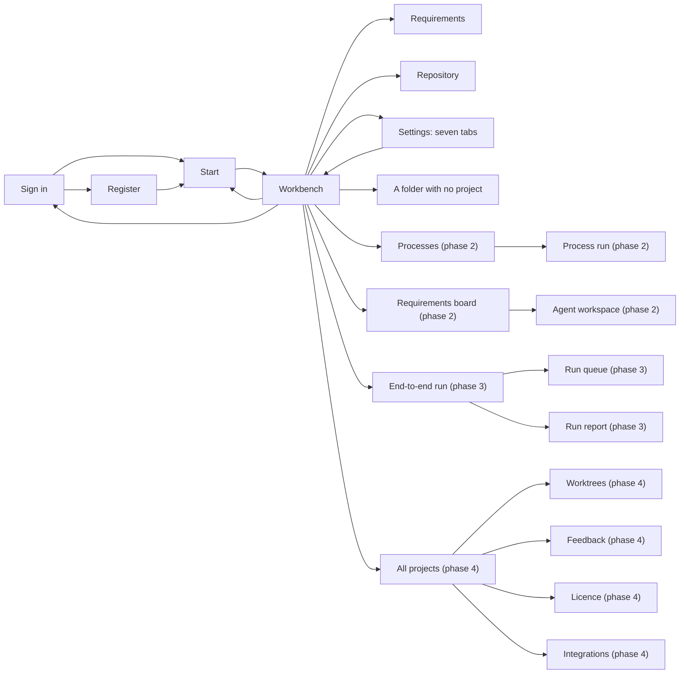

# Chatur — UI Design

| | |
|---|---|
| App | Chatur |
| Kind | app |
| Size | Large |
| Phase | 1 of 4 |
| UI library | TrBlazeUI 2.0.9 (`TrBlazeUI.Components`, `TrBlazeUI.Icons.Lucide`) |
| Theme | both, dark by default; Amber ships as the theme, with Indigo, Teal and Slate |

## Design system

- **Three windows.** The **start window** opens first: recent projects on the left, the ways in on the right — clone, open a solution, open a folder, new project, new empty folder. No menu bar, no files, no conversation, because nothing is open. The **main window** is where work happens: a menu bar (File, Edit, View, Project, Tools, Help), a toolbar (Run, Stop, Build, the run target, the branch, Find), the files down the left with the branch beneath them, one content area of tabs, the conversation pinned right at half the width, and an output strip. The **secondary window** holds everything that is not the work — Prerequisites, Repository, Settings, Licence, Feedback, Integrations, All projects, Working copies — as a title bar, a left navigation list and one page. No file tree, no conversation: there is nothing to say to an agent while changing a setting.
- **Menus and pickers really open**, each dropping its list with a tick on the chosen one. Nothing looks like a drop-down and behaves like a label.
- **Theme.** A theme is a named set of OKLCH values in the shape TrBlazeUI reads, carrying a light set and a dark set. Amber ships as the default, with Indigo, Teal and Slate; more are added from a file. Nothing is coloured by which agent is working.
- **Controls**, all real in 2.0.9: `Menubar`, `DropdownMenu`, `TreeView`, `EditorTabs`, `CodeEditor`, `DiffView`, `LogView`, `Typing`, `NavList`, `SortableList`, `DataTable` with row selection, small `Switch`, `Card`, `Badge`, `Alert`, `Button`, `Select`, `Dialog`, `Progress`, `Empty`, `LucideIcon`.
- **Rules:** 8 pixels between panels, 16 inside one. A panel scrolls inside itself; no window scrolls sideways. Below 1100 the file view and the conversation stack; below 980 the toolbar drops what only reports; below 820 the files panel goes.

## Screens

### Screen: Sign in (`/sign-in`)

**Mockup:** [mockups/sign-in.html](mockups/sign-in.html) · **Roles:** Visitor · **BRD:** BRD-1 to BRD-5

| Region | Control | Shows or binds |
|---|---|---|
| `signin-card` | Card | the whole of this screen; there is no window yet |
| `signin-error` | Alert | the server's own line, verbatim, with a pill saying it came from App Manager |
| `signin-form` | Input ×2 | `input-email`, `input-password`; submits to the Start view |
| `remember-row` | Tabs (two) | keep the token past a restart, or drop it when Chatur closes |
| `device-note` | Panel | the name this machine registers under, and that tokens live in the Keychain or Credential Manager |

| Field | Type | Required | Validation |
|---|---|---|---|
| Email | email | yes | must parse as an address |
| Password | password | yes | not empty; Chatur never pre-judges it, the server decides |
| Remember this device | two-way choice | no | on by default |

**Dialogs opened here:** none

**States:** empty: no error block, both fields blank, the button still live because the server decides · loading: the button reads "signing in…" and the fields go read-only · error: `signin-error` at the top of the card with the server's own words, focus back on the email, nothing typed lost — an unreachable App Manager uses the same slot with different text

### Screen: Register (`/register`)

**Mockup:** [mockups/register.html](mockups/register.html) · **Roles:** Visitor · **BRD:** BRD-6 to BRD-9

| Region | Control | Shows or binds |
|---|---|---|
| `register-form` | Input ×5 | first name, last name, email, password, confirm |
| `strength-bars` | Progress ×4 | how many of the four password rules are met |
| `password-rules` | Item list | each rule with a tick or a cross; the unmet one names the characters that count |
| `email-error` | field error | the address already has an account, linking to Sign in |
| `device-note` | Panel | this is the first machine on the account, and what it registers as |

| Field | Type | Required | Validation |
|---|---|---|---|
| First name, Last name | text | yes | 1 to 60 characters |
| Email | email | yes | must parse; the server refuses one already in use |
| Password | password | yes | at least 8 characters with a capital, a number and a special character |
| Confirm password | password | yes | the same as password |

**Dialogs opened here:** none

**States:** empty: no error, no bars filled, the strength reads none of four met · loading: the button is busy and the fields are read-only · error: under the field that caused it, never one lump at the top

### Screen: Start (`/start`)

**Mockup:** [mockups/start.html](mockups/start.html) · **Roles:** Owner · **BRD:** BRD-10 to BRD-15

A window of its own, the one that opens first. It carries no menu bar, no file tree and no conversation, because nothing is open yet.

| Region | Control | Shows or binds |
|---|---|---|
| `startbar` | title bar | the wordmark, the signed-in user, light or dark |
| `recent-list` | NavList | the projects worked in, newest first: name, path, what is to push, when. A solution and a bare folder are marked differently |
| `recent-search` | Button | filters the list by name or path |
| `forget` | Button | drops a project from the list; the folder on disk is untouched |
| `clone-repo` | Button | clones from GitHub, or any address pasted, and opens it |
| `open-solution` / `open-folder` | Button ×2 | a `.sln` with its projects read, or any folder as it is |
| `new-project` | Button | a solution from a template |
| `new-blank` | Button | an empty folder and an agent, for thinking something through before there is code |

| Field | Type | Required | Validation |
|---|---|---|---|
| Search | search | no | matches a name or any part of a path |
| Repository address | text | yes, when cloning | a git address this machine can reach; the folder it clones into must be empty |

**Dialogs opened here:** Clone a repository · Open a solution · Open a folder · New project — each the machine's own picker or a small form

**States:** empty: nothing opened yet — the recent list gives way to a line saying so, and the ways in stay where they are · loading: a clone shows its progress in place of the list, and the buttons wait · error: a folder that has moved keeps its row, marked, and offers to forget it

### Screen: Workbench (`/`)

**Mockup:** [mockups/main.html](mockups/main.html) · **Roles:** Owner · **BRD:** BRD-16 to BRD-26, BRD-44 to BRD-51, BRD-61 to BRD-69, BRD-80 to BRD-85

The window itself, and where the work happens.

| Region | Control | Shows or binds |
|---|---|---|
| `menubar` | Menubar | File, Edit, View, Project, Tools, Help; the signed-in user at the right |
| `toolbar` | Button row | `run`, `stop`, `build`, `target`, `repo`, `find` |
| `files-panel` | Card + tree | the project's files; `branch` beneath them opens the Repository |
| `tabs` | Tabs | the open files and views; `close-file-view` gives the conversation the window |
| `editor` | code pane | the open file with syntax colour; a change waiting on it is shown in place and the file is read-only until it is settled |
| `conversation` | ScrollArea | the turns, each naming its model, tokens and seconds; the agent's steps as chips |
| `proposed-change` | Card + diff | on disk against proposed, with Open, Approve and Reject |
| `composer` | Textarea + Button | the message, the model, the agent, the mode and Send |
| `agent-why` | text | why Chatur chose this agent, in one line |
| `output` | CodeBlock | the build and run output, live, with the result as a pill |

| Field | Type | Required | Validation |
|---|---|---|---|
| Message | textarea | yes | not empty; trimmed before sending |
| Model | select | yes | one of the connected providers' models |
| Agent | select | no | none means the model itself; Chatur pre-selects from the project's state |
| Mode | two-way choice | yes | ask first, or go ahead |
| Run target | select | yes | only a target this machine can build |
| File text | textarea | no | read-only while a change waits on that file |

**Dialogs opened here:** Unsaved changes — save, close without saving, cancel

**States:** empty: a folder with no project — the conversation takes the whole window and no target can be chosen ([drawn here](mockups/folder-only.html)) · loading: the reply shows as moving dots with its model named · error: a failed provider is shown in the conversation with the model that answered instead

### Screen: Prerequisites (`/prerequisites`)

**Mockup:** [mockups/prerequisites.html](mockups/prerequisites.html) · **Roles:** Owner · **BRD:** BRD-27 to BRD-31

| Region | Control | Shows or binds |
|---|---|---|
| `req-tiles` | Card ×4 | tools needed, ready, needing attention, when it was last checked |
| `tools-table` | DataTable | tool, needed, found, a state pill, and the fix as a command with a copy button |
| `this-chatur` | Card | version, the commit it was built from, and the machine |
| `download-build` | Alert + Button | a newer nightly, and that settings, agents and measurements survive the update |
| `path-note` | Panel | why a Homebrew tool is found when Chatur was started from Finder |
| `check-again` | Button | runs every probe again |

| Field | Type | Required | Validation |
|---|---|---|---|
| — | — | — | this view reads; every action is a button |

**Dialogs opened here:** none

**States:** empty: no project open, so only This Chatur fills · loading: each row shows a checking mark while its version command runs, and the tiles hold their last numbers · error: a probe that fails leaves its row unknown with the command's own message, and the attention tile counts it

### Screen: Settings (`/settings/{tab}`)

**Mockup:** [mockups/settings-providers.html](mockups/settings-providers.html) · **Roles:** Owner · **BRD:** BRD-32 to BRD-43, BRD-52 to BRD-60, BRD-70 to BRD-79, BRD-156, BRD-157

Seven tabs, seven components. The strip is navigation, not a control.

| Region | Control | Shows or binds |
|---|---|---|
| `settings-tabs` | Tabs as links | [providers](mockups/settings-providers.html) · [routing](mockups/settings-routing.html) · [agents](mockups/settings-agents.html) · [corrections](mockups/settings-corrections.html) · [measurements](mockups/settings-measurements.html) · [appearance](mockups/settings-appearance.html) · [account](mockups/settings-account.html) |
| `providers-table` | DataTable | per provider: connector, sign-in, address, models, state, Test, Remove |
| `secrets-panel` | Card | the Keychain, Credential Manager, and that the database keeps only the name |
| `tier-1` … `tier-3` | Card ×3 | each chain in order, with up, down, remove and add |
| `agent-tiers-table` / `work-tiers-table` | DataTable + Select | the tier per agent and per kind of work; the work wins |
| `agents-layout` | list + detail | the four agents; the chosen one's wording, rights, rules, history |
| `corrections-table` | DataTable + diff | what Chatur changed about itself; Keep or Undo |
| `stream-tiles` / `streams-table` | Card ×5 + DataTable | the five streams and the writes refused |
| `theme-cards` | selectable cards | Amber, Indigo, Teal, Slate, each with its own swatches |
| `theme-source-panel` | Card + Button | a theme is a file of values; add one, or export this one |
| `account-panel` / `machine-panel` | Card | who is signed in, what this machine is, where the tokens live |

| Field | Type | Required | Validation |
|---|---|---|---|
| Provider name | text | yes | unique among providers, at most 40 characters |
| Key | password | only for a pasted-key provider | never echoed back after saving |
| Move up a tier after | number | yes | 1 to 10; out of range snaps back to the last good value |
| Agent wording | textarea | yes | at least 40 characters; each save writes a new version |
| Theme | choice | yes | an added theme must carry every token the stock theme defines |

**Dialogs opened here:** Add a provider · Export and import agents · Add a theme from a file

**States:** empty: no providers, a blank state offering Add · loading: skeleton rows per tab · error: a failed Test marks that row alone, with the provider's own message

### Screen: Repository (`/repository`)

**Mockup:** [mockups/repository.html](mockups/repository.html) · **Roles:** Owner · **BRD:** BRD-86 to BRD-90

| Region | Control | Shows or binds |
|---|---|---|
| `branch-row` | Badge + Select + Button | the branch, what is to push and to pull, switch branch, Pull, Push |
| `changes-panel` | DataTable | each changed file: a tick, the path, a state pill, the lines added and removed |
| `file-change` | diff | the ticked file, on the branch against the working tree |
| `checkin` | Textarea + Button | the message and the check-in, which the owner submits |
| `agent-checkins` | DataTable | the branches a process checked in to by itself, with the requirement ids |
| `owner-note` | Panel | pushing and merging stay with the owner; a model asking for a source-control command is refused |

| Field | Type | Required | Validation |
|---|---|---|---|
| Switch branch | select | yes | a branch this repository has |
| Include file | checkbox | no | at least one before the check-in is live |
| Message | textarea | yes | not empty; a missing `[REQ-*]` tag warns, it does not block |

**Dialogs opened here:** none

**States:** empty: nothing changed, so a blank state saying the working folder is clean and the check-in is hidden · loading: the list and the counts are re-read after every pull, push or switch · error: a conflict or a rejected push keeps the page and says what the repository said, with nothing written

## Click-through flow

Start at [the list of screens](mockups/index.html), which names every view in the order it is met.

